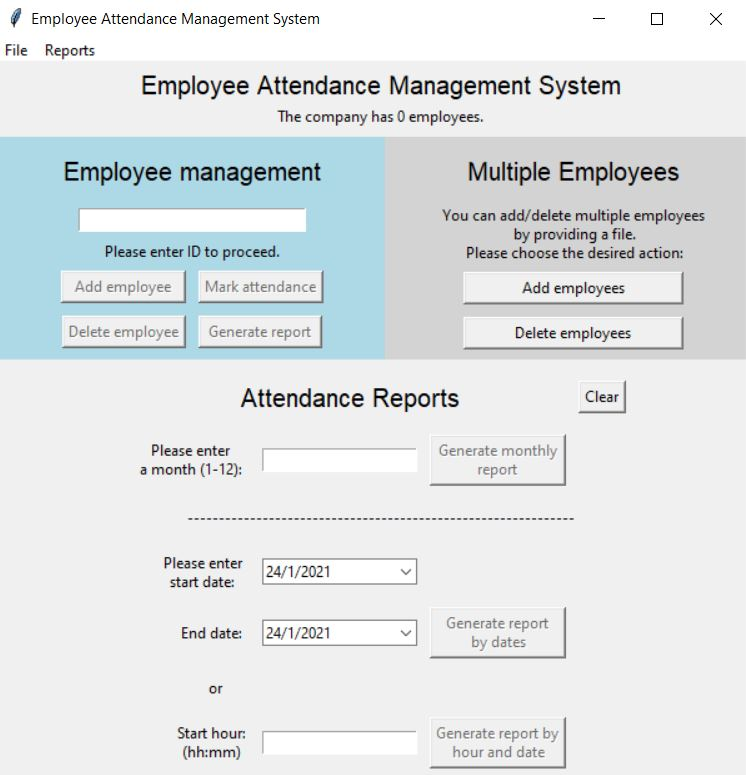

# Employee-Attendance-Management-System
She Codes learning project for python course using PostgreSQL and PGadmin

## **Running the project**

### **Init docker and database:**
1. In terminal run: `docker-compose up --detach`.
2. Install dependencies using `pipenv install`.
3. Run `init_database.py` to setup your database.
4. Use `main.py` to start the GUI.

## **Project Files**

#### **The project is built from 5 source files:**
1. **Main** - Used to start the program.
2. **Employees** - includes the Employee class and all related methods and functions.
3. **Attendances** - includes the Attendance class and all related functions.
4. **Gui** - Used to set up the GUI for the program including menus and widgets.
5. **db_connect** - includes all the SQL queries that are used to communicate with the database

#### Init and Config files:
1. **database.ini** - stores basic variables as host, user, password, database. Used by `config.py` .
2. **config.py** - starts the connection with the database. Used in `main.py` and `init_database.py`.
3. **init_database.py** - initialises the tables in the database. Sould run it before running `main.py` for the first time.

#### **The data will be stored in 2 tables in the DB:**
1. **Employees** - stores data about the employees, includes _(ID, name, phone number and birthday)_.
2. **Attendance** - stores the attendance data of the company, includes _(date, time, ID)_.

## **Project Functions**

#### The data structure:
1. **Employees:**  

    1.1. Uses Employees table with 5 fields: 
    - ID - 9 digits. 
    - Name - a string, can include two words or more. 
    - Title - Manager, Senior or Junior. 
    - Phone - 9/10 digits, can include a `-` after the prefix(2/3 first digits).  
    - Birthday - uses the template dd/mm/yyyy.
    
    1.2. ID is key.
    1.3. Employee class instance is used when reading from the employee data table.
    
2. **Attendance Log:** 
 
    2.1. Uses Attendance table with 3 fields: 
    - ID - 9 digits  
    - Date - uses the template dd/mm/yyyy (auto update on creation)
    - Time - uses the template HH:MM (auto update on creation)
    
    2.2. Date and Time are used as key (timestamp).

#### Employees related functions: 
Each function updates employees table.  
1. Add employee manually - uses an add employee menu with proper fields, includes verification and checks for doubles based on ID.
2. Add employee from file - accepts a `.csv` file, adds the employees only if all the data in the rows is valid. 
Prompts the user about the first encountered invalid data.
3. Delete employee manually - deletes an employee by ID, prompts if the employee doesn't exist or invalid ID.
4. Delete employees from file - accepts a `.csv` file, deletes the employees by ID only if all the supplied data is valid (only ID's in the file). 
Prompts the user with number of deleted users or first invalid row.

#### Attendance related functions:
5. Mark attendance - given an ID, creates a new Attendance record and updates the database.  
6. Generate attendance report of an employee - user enters ID and gets his attendance report(file). 
Prompts if the employee ID doesn't exist/invalid or has no attendance registered.
7. Print an attendance report for a chosen month for all employees (active only) - prompts for month, 
will use current month as default and last year, generates a file.
8. Print an attendance report for all employees who were late (choose arrival time limit) - prompts for hour and start date, 
generates a report for all attendances after chosen hour from chosen date till now (file).
9. Print an attendance report by dates - prompts for dates and checks validity, creates a file.

#### More functions:
0. Exit the program - exits the program, prompts the user farewell.
